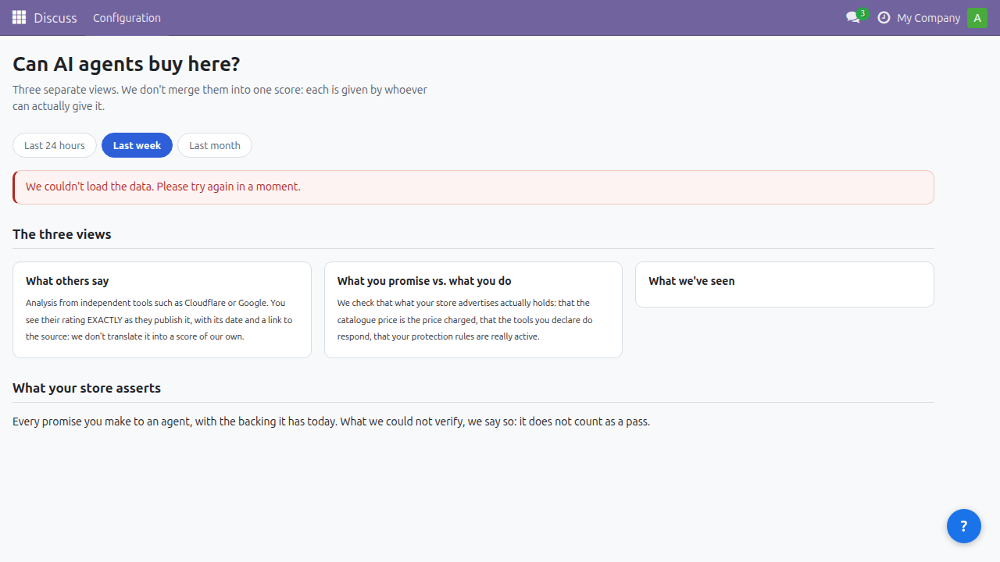

[English](README.md) | [Español](README.es.md) | [Français](README.fr.md) | **Deutsch**

# Trusteed Agentic Commerce für Odoo

Ermöglichen Sie neuen Online-Käufern, den KI-Agenten, sichere und zuverlässige Einkäufe in Ihrem Shop dank Trusteed: dem Netzwerk, das Vertrauen zwischen Unternehmen und Agenten fördert.

- **Legen Sie Ihre Geschäftsregeln fest**: wen Sie zum Kauf zulassen, bis zu welchem Betrag, welche Kategorien Sie Agenten nicht anbieten möchten, Preisgrenzen, Lagerbestände zum Schutz vor potenziell betrügerischen Agenten und mehr.
- **Manipulationssichere Belege**: Wir erstellen kryptografisch signierte Belege (JWS Ed25519), an denen jede Veränderung sichtbar wird und die im Streitfall als Nachweis der tatsächlichen Transaktion dienen. Sie sind an den Beweiskonzepten von eIDAS (EU, UK) und eSIGN (USA) ausgerichtet — eine Signatur fortgeschrittener Art, **keine** qualifizierte: heute gibt es in der Produktion keinen qualifizierten Zeitstempel und kein QTSP-Siegel.
- **Agentenanalysen**: Sehen Sie Statistiken zu Agentenkäufen — wie viel sie ausgeben, welche Produkte sie kaufen und wie oft.
- **Agentensperrung**: Blockieren Sie potenziell gefährliche oder problematische Agenten.
- **Digitale Währungen**: Ermöglicht Käufe in digitalen Währungen dank des X402-Protokolls.
- **Peer-to-Peer-Transaktionen**: Ermöglicht direkten Handel zwischen Agenten und Händlern.
- **Agent-Readiness-Dashboard**: prüft live, ob KI-Agenten heute wirklich in Ihrem Shop einkaufen können — drei unabhängige Ansichten (was andere sagen, was Sie versprechen vs. was Sie tun, was wir beobachtet haben), ohne sie zu einem erfundenen Gesamtwert zu verschmelzen.

## Screenshots

| Trust Center | My Sales — Meine Bestellungen | My Sales — AI Sales |
|---------------|-----------------------------------|--------------------------|
|  |  |  |

| My Sales — Schlüssel | My Sales — Audit | Einstellungen |
|---------------------------|----------------------|----------------|
|  |  |  |

| Schnelleinrichtungs-Assistent | Agent Readiness |
|--------------------------------------|------------------|
|  |  |

Jede Agenten-Transaktion erzeugt einen kryptografisch signierten **Trust Receipt** — einen Nachweis, an dem jede Veränderung sichtbar wird (JWS Ed25519, an den Beweiskonzepten von eIDAS / eSIGN ausgerichtet, ohne qualifizierten Zeitstempel), gelistet unter **My Sales → AI Sales**. Signierschlüssel und ein vollständiges Audit-Protokoll stehen im selben **My Sales**-Menü zur Verfügung, und der Bildschirm **Trust Center** zeigt den Gesamt-Vertrauenswert Ihres Shops.

## Funktionen

Trusteed vereint ein Trust Center, ein Verzeichnis signierter Belege und 5 native agentische Tools in einem einzigen Odoo-Addon.

- **Trust Center** — Vertrauenswert des Shops, signierte Trust Receipts, Signierschlüssel, Audit-Protokoll
- **My Sales** — Bestellungen, Verkäufe an KI-Agenten, Signierschlüssel, Audit-Protokoll, alles in einem Menü
- **5 native KI-Tools**, bereitgestellt über `ir.actions.server` (`usage='ai_tool'`): `sign-trust-receipt`, `verify-agent-signature`, `dispatch-payment-acp`, `dispatch-payment-x402`, `dispatch-payment-ap2` — **es sind heute nicht alle fünf einsatzbereit**, siehe [Status der nativen KI-Tools](#status-der-nativen-ki-tools)
- **Vertrauens-Badge an der Bestellung** — ein berechnetes Vertrauenswert-Badge, eingefügt in die native `sale.order`-Kanban-Ansicht
- **Automatischer JWS-Beleganhang** — signierte Trust Receipts werden `account.move`-Datensätzen beim Buchen automatisch angehängt
- **Multi-Unternehmen-Unterstützung** — stilles erneutes Bootstrapping mit Toast-Benachrichtigung bei Wechsel des aktiven Unternehmens
- **Schnelleinrichtungs-Assistent** — ein 4-stufiger Onboarding-Ablauf, der Ihre Odoo-Instanz mit Trusteed verbindet
- **Fail-closed als Standard** — SSRF-geschützte ausgehende Aufrufe, nur HTTPS, die Regeldurchsetzung erlaubt bei Fehlkonfiguration niemals stillschweigend

### Status der nativen KI-Tools

Alle fünf Tools werden bei der Installation registriert, aber nur eines ist standardmäßig aktiviert **und** von einem bereitgestellten Endpunkt gedeckt. Die Schalter finden Sie unter **Einstellungen → Trusteed**.

| Tool | Standard | Status heute |
|------|----------|--------------|
| `verify-agent-signature` | aktiviert | **Einsatzbereit** — Signaturprüfung nach RFC 9421 |
| `dispatch-payment-acp` | **deaktiviert** | Funktioniert, aber Opt-in: agenteninitiierte Zahlung, Sie aktivieren sie selbst |
| `dispatch-payment-x402` | **deaktiviert** | Funktioniert, aber Opt-in: agenteninitiierte Zahlung, Sie aktivieren sie selbst |
| `sign-trust-receipt` | aktiviert | **Noch kein Backend bereitgestellt** — meldet sich stets als nicht verfügbar, unabhängig vom Schalter. Belege werden weiterhin vom Checkout-Ablauf erzeugt und sind unter **My Sales → AI Sales** lesbar |
| `dispatch-payment-ap2` | **deaktiviert** | **Noch kein Backend bereitgestellt** — meldet sich stets als nicht verfügbar, unabhängig vom Schalter |

Einen Schalter einzuschalten macht ein Tool ohne bereitgestelltes Backend niemals aufrufbar; der Schalter bewahrt nur Ihre Voreinstellung für den Zeitpunkt, an dem dieses Backend verfügbar wird.

**Tool-Erkennung.** `usage='ai_tool'` wird von Odoos AI App in **Odoo 19.0** vollständig unterstützt. In der Serie Odoo 18.x, auf die dieses Addon zielt, existiert das Feld, aber die Erkennungs-Oberfläche der AI App zeigt diese Aktionen möglicherweise nicht — programmatisch aufrufbar bleiben sie (`env.ref(...).run()`).

## Kompatibilität

| Komponente | Unterstützt |
|------------|-------------|
| Odoo | 18.0 (Community oder Enterprise) |
| Python | 3.10+ |
| Bereitstellung | Odoo.sh oder On-Premise-Installation — **nicht** verfügbar bei Odoo Online (SaaS), das benutzerdefinierte Drittanbieter-Module blockiert |

## Voraussetzungen

- Odoo 18.0, auf Odoo.sh oder einer On-Premise-Installation
- Python 3.10+
- Ein Trusteed-Konto — [kostenlos registrieren auf trusteed.xyz](https://trusteed.xyz)
- **Odoo-Apps** (werden automatisch als Abhängigkeiten installiert): `base`, `web`, `mail`, `sale`, `account`, `stock`, `sale_stock`
- **Python-Paket `cryptography`** — im Manifest unter `external_dependencies` deklariert; ohne es verweigert Odoo die Installation des Addons. Wird für die Ed25519-Signaturprüfung des Regel-Snapshots, die Agentenidentität nach RFC 9421 und die JCS-Kanonisierung nach RFC 8785 verwendet. Installation mit `pip install cryptography` auf dem Odoo-Server (bei Odoo.sh: in Ihre `requirements.txt` aufnehmen).

## Installation

### Manuelle Installation

1. **Laden Sie die installierbare `.zip`** von der neuesten GitHub-Release herunter:
   [**⬇ Neueste Version herunterladen**](https://github.com/Trusteedxyz/agentic-commerce-odoo/releases/latest)
   — die `.zip` ist dieser Release als Anhang beigefügt. Ältere Versionen finden Sie auf der
   [Releases-Seite](https://github.com/Trusteedxyz/agentic-commerce-odoo/releases).
2. Entpacken Sie sie in Ihren Odoo-`addons_path` — der entpackte Ordner muss `trusteed` heißen (der technische Name des Addons).
3. Starten Sie Odoo neu: `systemctl restart odoo` (oder das Äquivalent für Ihre Bereitstellung).
4. Im Odoo-Back-Office: **Einstellungen → Entwicklermodus aktivieren**.
5. **Einstellungen → Apps → App-Liste aktualisieren**, dann nach "Trusteed" suchen und auf **Installieren** klicken.
6. Öffnen Sie das neue **Trusteed**-Menü — der Schnelleinrichtungs-Assistent öffnet sich automatisch.

### Aus dem Quellcode (Zip selbst erstellen)

```bash
git clone https://github.com/Trusteedxyz/agentic-commerce-odoo.git
cd agentic-commerce-odoo
bash bin/build-zip.sh   # erzeugt dist/trusteed-agentic-commerce-odoo-<version>.zip
```

### Docker / lokale Entwicklung

Die Compose-Datei, die das Team für Staging verwendet (`e2e/docker/odoo-staging.yml`), liegt im privaten Entwicklungs-Monorepo von Trusteed und ist **nicht** Teil dieses Repositorys. Um das Addon in Docker zu testen, starten Sie einen beliebigen Standard-Container für Odoo 18 — siehe das [offizielle Odoo-Image](https://hub.docker.com/_/odoo) — und mounten Sie den entpackten Ordner `trusteed` in einen Pfad, der im `addons_path` dieses Containers steht.

Dann in Odoo: **Einstellungen → Apps → Trusteed → Installieren**.

## Konfiguration

Der Schnelleinrichtungs-Assistent (**Trusteed → Quick Setup**) führt durch den gesamten Ablauf:

1. **Willkommen** — bestätigt die Voraussetzungen (ein Trusteed-Konto + ausgehendes HTTPS vom Odoo-Server).
2. **Verbinden** — öffnet das Trusteed-Portal unter [trusteed.xyz/dashboard](https://trusteed.xyz/dashboard), wo Sie zu **Store verbinden → Odoo** navigieren.
3. **Zugangsdaten** — fügen Sie Ihre **Merchant ID** und Ihr **Bootstrap Secret** ein (64 Hex-Zeichen).
4. **Test** — überprüft die Verbindung vor dem Abschluss.

Zugangsdaten können auch direkt unter **Einstellungen → Trusteed** eingegeben werden, ohne den Assistenten zu durchlaufen.

### Systemparameter

| `ir.config_parameter`-Schlüssel | Standard | Zweck |
|-------------------------------------|----------|-------|
| `trusteed.merchant_id` | _(leer)_ | Von Trusteed ausgestellte Merchant ID |
| `trusteed.bootstrap_secret` | _(leer)_ | 64-Hex-Zeichen-Secret, `password=True`, beschränkt auf `group_admin` |
| `trusteed.api_base` | `https://api.trusteed.xyz` | Endpunkt des Trusteed-Backends |

## Admin-Menüs

Nach der Installation erscheint ein **Trusteed**-Menü oberster Ebene im Odoo-Back-Office:

| Menü | Beschreibung |
|------|--------------|
| Quick Setup | 4-stufiger Onboarding-Assistent |
| Trust Center | Überblick über den Vertrauenswert des Shops |
| My Sales | Meine Bestellungen, AI Sales, Schlüssel, Audit — alles an einem Ort |
| Einstellungen | Merchant ID, Bootstrap Secret, API-Basis-URL und Toggles je Tool |

Das Admin-Panel ist ein Bundle, das mit den Konnektoren für WooCommerce und PrestaShop geteilt wird, und enthält daher auch Bereiche, die der Odoo-Host nicht bereitstellt: `inicio`, `mis-reglas`, `seguridad`, `agentes`, `payment-methods` und `merchant-center`. Die Odoo-Client-Aktionen laden ausschließlich `trust-center` und `mis-ventas`, und nichts innerhalb dieser beiden Seiten verlinkt auf die übrigen — in Odoo sind diese Bereiche also nicht erreichbar, und die Tabelle oben ist die vollständige Liste dessen, was Sie aus dem Back-Office öffnen können.

## Regeldurchsetzung beim Checkout

Über das Trust Center hinaus installiert das Addon eine Durchsetzungsschicht, die auf den eigenen Verkaufsaufträgen des Shops arbeitet (`models/sale_order_enforcement.py` und die Dateien darum herum). Im Überblick:

- Sie fängt die **Bestätigung des Verkaufsauftrags** über alle drei Eintrittspfade ab — das `action_confirm` aus Oberfläche und RPC, das Anlegen eines Auftrags direkt mit `state='sale'` sowie das Schreiben von `state='sale'` auf einen bestehenden Auftrag — damit ein headless XML-RPC- oder JSON-RPC-Client die Prüfung nicht umgehen kann.
- Bei jeder Bestätigung lädt sie Ihren **Regel-Snapshot** von Trusteed, prüft dessen JWS-Ed25519-Signatur und hält ihn 5 Minuten im Prozess-Cache.
- Liegt ein Agenten-Token vor, wird es offline geprüft; eine **BLOCK**-Entscheidung verweigert die Bestätigung mit einem `trusteed:R0xx`-Fehler, der die auslösende Regel benennt.
- Ist der Snapshot nicht verfügbar, der Notausschalter aktiv oder tritt etwas Unerwartetes ein, entscheidet der konfigurierte **Fallback-Modus**: `strict` blockiert, `balanced` und `permissive` lassen den Auftrag durch. Die Bestätigung stürzt nie ab.
- Eine geplante Aktion, **„Trusteed CEL: Refresh Rule Snapshot“** (`data/cron.xml`), wärmt diesen Cache **alle 5 Minuten** vor, damit der erste Auftrag jedes Intervalls die Latenz des Kaltabrufs nicht bezahlt. Zu finden und abschaltbar unter **Einstellungen → Technisch → Automatisierung → Geplante Aktionen**.

## FAQ

**Welche Daten werden gesendet?** Nur was Regeldurchsetzung und Trust Receipts benötigen (Bestellsummen, Land, Agentenidentität). Es laufen niemals Zahlungskartendaten über Trusteed. Die gesamte Kommunikation erfolgt über HTTPS.

**Welche Agenten werden unterstützt?** Jeder Agent, der über einen MCP-kompatiblen Client verbunden ist und die nativen KI-Tools dieses Addons aufruft, einschließlich Claude Desktop. Zwei Einschränkungen, die man kennen sollte, bevor man darauf plant: heute ist nur `verify-agent-signature` aktiviert und einsatzbereit (siehe [Status der nativen KI-Tools](#status-der-nativen-ki-tools)), und Odoos eigene AI App zeigt diese Tools nur unter Odoo 19.0 zuverlässig an — unter 18.x erscheinen sie in deren Erkennungs-Oberfläche möglicherweise nicht.

**Verlangsamt es meinen Shop?** Nein. Die Regeldurchsetzung läuft synchron nur beim jeweiligen Transaktionsschritt, mit Fail-closed als Standard statt einer pauschalen Erlaubnis-Rückfallebene.

**Kann ich es auf Odoo Online (SaaS) installieren?** Nein — Odoo Online erlaubt keine benutzerdefinierten Drittanbieter-Module. Verwenden Sie Odoo.sh oder eine On-Premise-Installation.

## Das Dashboard zur Agenten-Bereitschaft

**Finden mich Agenten?** ist eine Seite in Ihrem Verwaltungsbereich, die eine
einzige Frage beantwortet: Wenn ein KI-Einkaufsagent Ihren Shop besucht, bekommt
er das, was Sie glauben, dass er bekommt?

Es wird nie eine einzelne Note angezeigt. Drei Spalten, die nicht gemittelt
werden, weil sie unterschiedliche Fragen beantworten und sich zu Recht
widersprechen können:

| Spalte | Was sie bedeutet |
| --- | --- |
| **Was ein Dritter sagt** | Das Urteil eines externen Scanners, wörtlich zitiert. Nie in eine eigene Skala übersetzt: Sobald man die Note eines anderen umrechnet, korrigiert man seine eigene Prüfung |
| **Stimmt überein, was Sie sagen, mit dem, was Sie tun?** | 16 Prüfungen, die das, was Ihr Shop **ankündigt**, mit dem vergleichen, was er **tatsächlich antwortet**. Genau das kann kein externer Scanner leisten: Es braucht Ihre Zugangsdaten |
| **Was wir gesehen haben** | Echter Agentenverkehr im gewählten Zeitraum: welche Agenten kamen, welche Werkzeuge sie nutzten, wie weit sie kamen und woran sie scheiterten |

Eine Prüfung, die nicht durchgeführt werden konnte, wird als **nicht geprüft**
ausgewiesen — mit Begründung. Sie wird nie stillschweigend verworfen und nie als
bestanden gewertet. «Wir konnten nicht nachsehen» und «wir haben nachgesehen und
es war in Ordnung» sind verschiedene Antworten, und die Seite sagt, welche gilt.

### Was jede Prüfung betrachtet

| Prüfung | Was sie erkennt |
| --- | --- |
| C1 | Sie kündigen Werkzeuge an, die Ihr Shop nicht bereitstellt |
| C2 | Sie kündigen ein Checkout-Protokoll an, dessen Endpunkt nicht antwortet |
| C3 | Der Katalogpreis ist nicht der berechnete Preis |
| C4 | Als verfügbar angekündigt, obwohl nicht verfügbar |
| C5 | Ihre Rückgaberichtlinie sagt je nach Quelle etwas anderes |
| C6 | Sie kündigen etwas als verfügbar an, das abgeschaltet ist |
| C7 | Aktivierte Regeln, die mangels Daten nicht greifen können |
| C8 | Ihre Regeln beobachten, blockieren aber nicht |
| C9 | Die angekündigte Authentifizierungsmethode funktioniert nicht |
| C10 | Ein Agent kann jeden Betrag ohne Ihre Bestätigung kaufen |
| C11 | Die Verkaufsstelle verwendet abgelaufene Regeln |
| C12 | Vorgänge ohne signierten Beleg |
| C13 | Angekündigte Adressen, die nicht funktionieren |
| C14 | Agenten sehen veraltete Daten Ihres Shops |
| C15 | Identitätsnachweise kurz vor Ablauf |
| C16 | Die zugesagte Lieferzeit ist nicht die eingehaltene |

Einige Prüfungen brauchen mehr als Ihre Einstellungen, und die Seite sagt es,
statt eine Lücke zu lassen:

- **Erfordert einen verbundenen Shop** (C3, C4, C5, C14): Sie vergleichen mit
  Ihrem echten Katalog, und ohne Zugangsdaten gibt es nichts zu vergleichen.
- **Erfordert ausgelieferte Bestellungen** (C16): Vergleicht Zusage und
  tatsächliche Einhaltung, was ohne Historie nicht möglich ist.
- **Diesmal gab es nichts zu vergleichen**: C12 etwa hat nichts zu prüfen, bevor
  ein Agent tatsächlich einen Kauf abgeschlossen hat. Das ist kein Durchfallen.

Die Prüfungen laufen einmal täglich, und die Seite zeigt das Ergebnis **mit
seinem Datum**, damit ein Urteil von gestern auch wie eines von gestern aussieht.
Ein gespeichertes «alles in Ordnung», das als aktuell dargestellt wird, wäre
genau die Selbsttäuschung, die diese Seite aufdecken soll.

## Änderungsprotokoll

### 18.0.1.2.4 — Sicherheitshärtung

- Gehärtet: Die Verifizierung des Agent-Tokens weist unerwartet geformte Eingaben jetzt sauber zurück, statt einen internen Fehler zu riskieren. Kein ausnutzbarer Fehler hier — anders als bei anderen Plattformen dieser Familie lässt hier kein Pfad eine Bestellung wegen dieses Fehlers durch — aus Konsistenzgründen gehärtet nach einem Sicherheitshinweis zum PrestaShop-Modul. Siehe [GHSA-2j2x-5q52-g48m](https://github.com/Trusteedxyz/agentic-commerce-prestashop/security/advisories/GHSA-2j2x-5q52-g48m).

### 18.0.1.2.3

- Neu: wenn eine Prüfung nicht durchgeführt werden konnte, erklärt das Panel jetzt, was sie freischalten würde — nichts zu tun, Einrichtung nötig, Daten stehen noch aus, oder eine unserer eigenen Prüfungen ist fehlgeschlagen — statt einer unerklärten grauen Liste.
- Neu: das Panel zeigt jetzt, welcher unserer Server Ihre Anfrage beantwortet hat, ein kurzes, undurchsichtiges Kürzel. Nützlich zum Vergleich mit dem, was der Support sieht; es verrät nie einen Hostnamen oder Dienstnamen.

### 18.0.1.2.2

- Neu: Unter Einstellungen wählen Sie jetzt aus, welche Werkzeuge Ihr Shop an Agenten ausliefert. Wenn Sie nie eine Liste gespeichert haben, sagt Ihnen das Panel, dass der ausgelieferte Umfang der Grundumfang der Plattform ist und nicht Ihre Wahl.
- Neu: eine Schaltfläche, um die Prüfung ohne Warten auf den täglichen Durchlauf zu wiederholen, und das Panel merkt sich, was sich seit der vorherigen Prüfung geändert hat.
- Geändert: unsere eigenen Störungen zählen nicht mehr als Abweichungen Ihres Shops. Das Panel trennt sie, weil Sie daran nichts ändern können.

### 18.0.1.2.1

- Behoben: Die Seite zur Agenten-Bereitschaft wurde ohne ihr Stylesheet ausgeliefert, sodass das Panel unformatiert dargestellt wurde.
- Behoben: Das Panel konnte die Oberfläche in einer Sprache und die Diagnose in einer anderen anzeigen. Die ermittelte Sprache wird jetzt zusammen mit den Texten weitergereicht, statt zweimal getrennt erkannt zu werden.
- Behoben: Das Panel übergab die Sprache des Odoo-Benutzers nicht, sodass die Diagnose in der Sprache des Browsers statt in seiner eigenen zurückkam.
- Neu: Jeder Befund enthält einen Link dorthin, wo er behoben wird, und die Zusagen des Händlers — die Lieferzeit und die übrigen — erscheinen mit dem jeweils vorhandenen Beleg.
- Geändert: Ein Shop ohne bisherige Prüfung wird als „wird geprüft“ angezeigt statt als „wird einmal täglich geprüft“: Das Öffnen des Panels startet die erste Prüfung bereits im Hintergrund.

### 18.0.1.2.0

- **Neu — Dashboard zur Agenten-Bereitschaft.** *Finden mich Agenten?* ist jetzt im Verwaltungsbereich verfügbar. Es vergleicht, was Ihr Shop ankündigt, mit dem, was er tatsächlich antwortet — in **16 Prüfungen**, und zeigt alle sechzehn, nicht nur die fehlgeschlagenen. Eine Prüfung, die nicht laufen konnte, nennt den **Grund** (Shop nicht verbunden, noch keine ausgelieferten Bestellungen, diesmal nichts zu vergleichen), statt eine Lücke zu lassen, die wie ein Defekt wirkt. Siehe «Das Dashboard zur Agenten-Bereitschaft» oben.
- **Behoben** — die Diagnose wurde innerhalb der API auf Spanisch verfasst und unverändert angezeigt: Wer den Bereich auf Englisch nutzte, las englische Überschriften über spanischen Befunden. Die Prüfungen liefern jetzt sprachneutrale Codes, und der Text wird beim Ausliefern in Ihrer Sprache erzeugt.
- **Behoben** — Prüfung C1 («Sie kündigen Werkzeuge an, die Ihr Shop nicht bereitstellt») wertete den gesamten öffentlichen Katalog als bereitgestellt, wenn keine Werkzeugliste konfiguriert war: gemeldet wurden 46 von 48, tatsächlich liefert der Server 12. Der Fehler ging in die schmeichelhafte Richtung — genau die, die dieses Dashboard aufdecken soll.
- **Behoben** — Prüfung C6 («Sie kündigen etwas als verfügbar an, das abgeschaltet ist») meldete eine Funktion als abgeschaltet, sobald ihr Schalter nicht gesetzt war — auch bei Schaltern, die standardmäßig aktiv sind. Das war ein Fehlalarm in jedem Shop.

### 18.0.1.1.2

- **Behoben** — das Admin-Panel-Bundle (`static/src/js/admin-spa.js`) wurde unminifiziert ausgeliefert: 869 KB / 25.064 Zeilen statt der 490 KB / 41 Zeilen, die der dokumentierte Build-Befehl (`pnpm run build:odoo`) tatsächlich erzeugt. Es funktionierte trotzdem, aber die Herkunft ließ sich nicht verifizieren. Neu aus der Quelle gebaut; das kompilierte Bundle stimmt jetzt zeichengenau mit der Ausgabe des Build-Befehls überein.
- **Behoben** — `R047.customer-confirmation` (die Regel, die den Käufer bittet, einen Agentenauftrag über einen separaten Kanal per E-Mail oder SMS zu bestätigen) hatte kein Formularfeld im Admin-Panel: ihre Betragsschwelle existierte im Schema, konnte aber nur über die API gesetzt werden. Ebenfalls behoben: Beim Anzeigen einer Händler-Kategorie wurden die Anti-Injection-Trennzeichen (`<<<MERCHANT_CONTENT_START>>> … <<<MERCHANT_CONTENT_END>>>`) mit ausgegeben, statt sie für die Darstellung zu entfernen.

### 18.0.1.1.1

- **Behoben** — `_DOCS_URL` verwies auf `https://docs.trusteed.xyz/embed/odoo-onprem`, einen Host, der NXDOMAIN zurückgibt. Jeder Händler, der dem In-App-Dokumentationslink folgte, erhielt einen Browserfehler statt der Integrationsanleitung. Verweist jetzt auf `https://trusteed.xyz/en/integrations/odoo`.

### 18.0.1.1.0

- **Sicherheitsfix** — die Replay-Erkennung des Agent-Token-Verifizierers hing an einem `if nonce:`, sodass ein Token, das den `nonce`-Claim schlicht wegließ, die Offline-Replay-Erkennung vollständig umging. Der Claim ist jetzt verpflichtend (16–64 Zeichen, wie es das kanonische Token-Schema verlangt) und ein Token ohne ihn wird abgelehnt — fail-closed, wie in den Konnektoren für WooCommerce, PrestaShop und Magento.
- **Neu** — das Addon meldet jetzt, welche Warenkorb-Signale diese Installation projizieren kann (`POST /api/v1/enforcement/capabilities`, HMAC-signiert, aus dem Post-Init-Hook gesendet — genau dann ändert sich die Addon-Version). Ohne das liefert eine Regel, deren Signal nie eintrifft, bei jedem Checkout `NO_SIGNAL`: sie passiert stillschweigend, und der Händler sieht eine Regel in ENFORCE, die nichts blockiert. Die Meldung reicht niemals einen Fehler weiter — ein Netzwerkproblem darf keine Installation oder Aktualisierung zum Scheitern bringen.

### 18.0.1.0.0

- Erste öffentliche Version: Trust Center, My Sales (Bestellungen, Verkäufe an KI-Agenten, Schlüssel, Audit), Schnelleinrichtungs-Assistent, Integration in Einstellungen, 5 native KI-Tools, Vertrauens-Badge an der Bestellung, automatischer JWS-Beleganhang, Multi-Unternehmen-Unterstützung.

## Support

- Support-E-Mail: support@trusteed.xyz
- GitHub Issues: [github.com/Trusteedxyz/agentic-commerce-odoo/issues](https://github.com/Trusteedxyz/agentic-commerce-odoo/issues)

## Lizenz

LGPL-3.0. Vollständiger Text siehe [LICENSE](LICENSE) — entspricht der in `__manifest__.py` deklarierten Lizenz.
