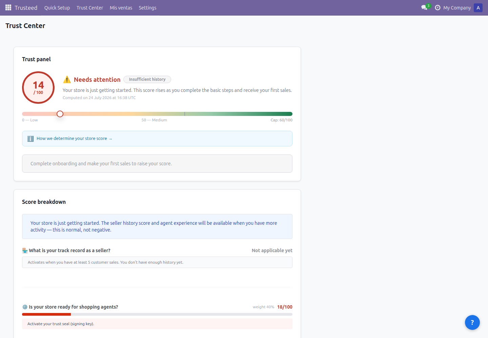
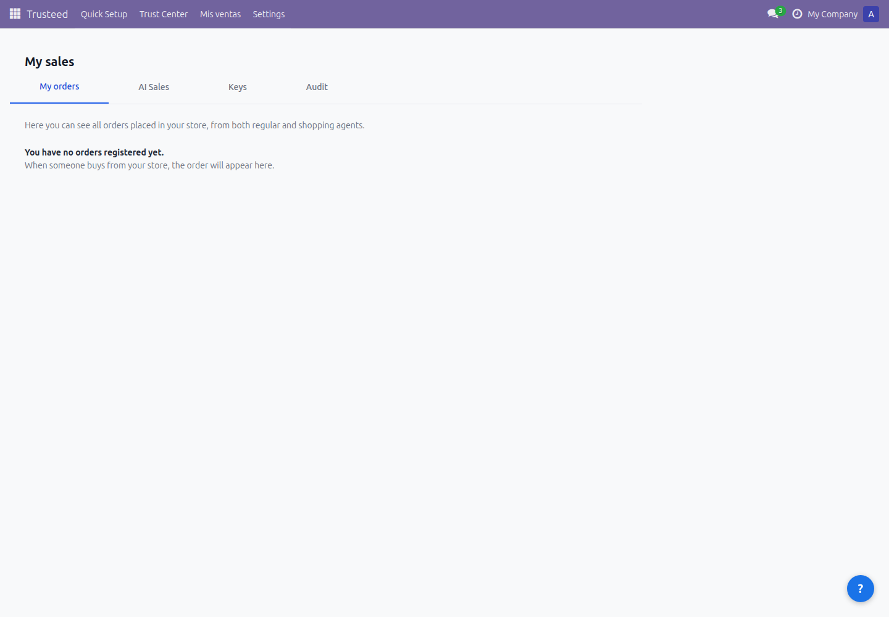
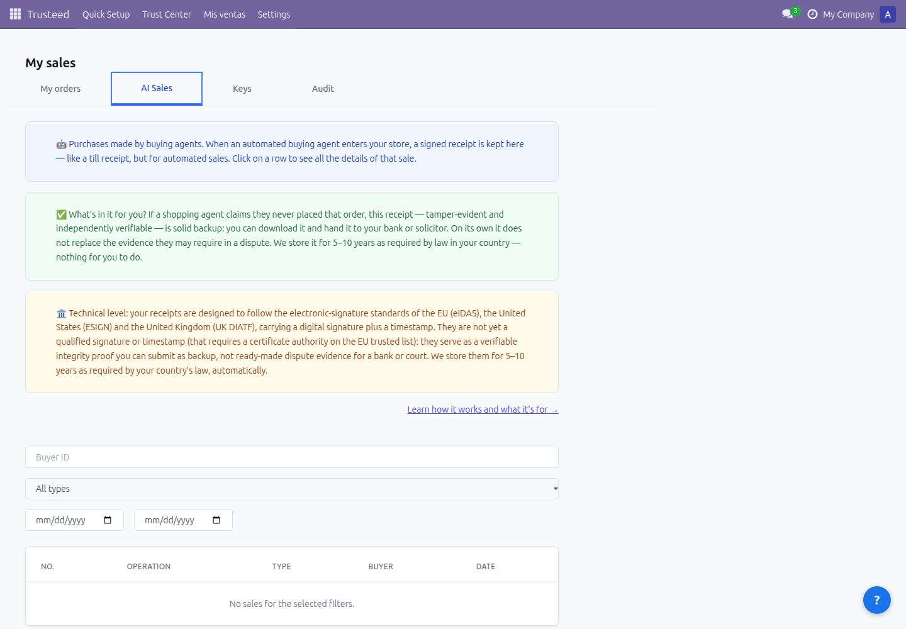
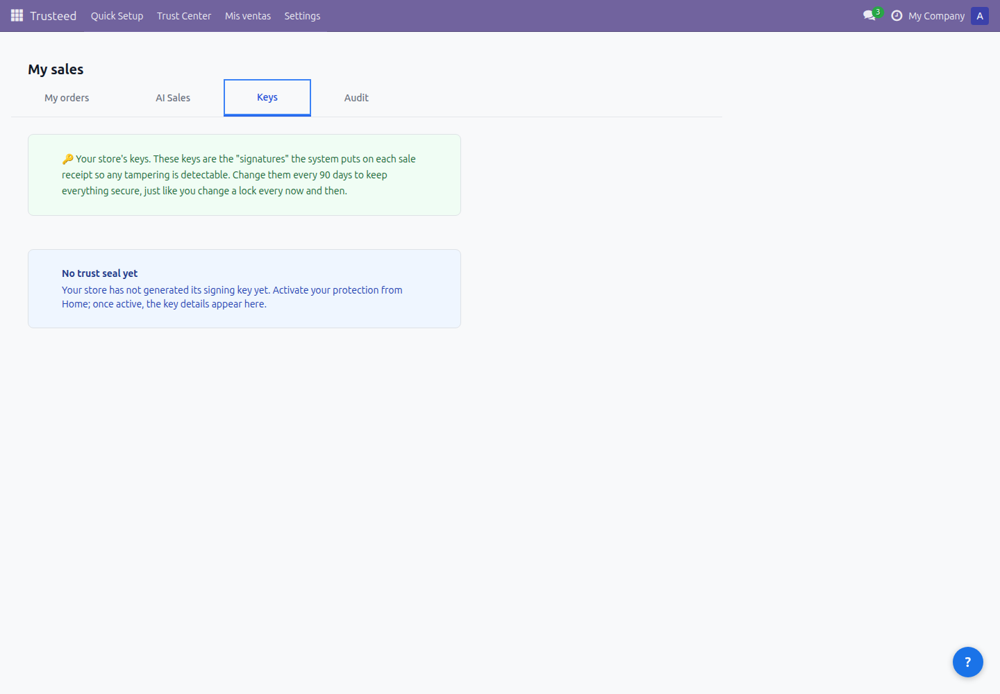
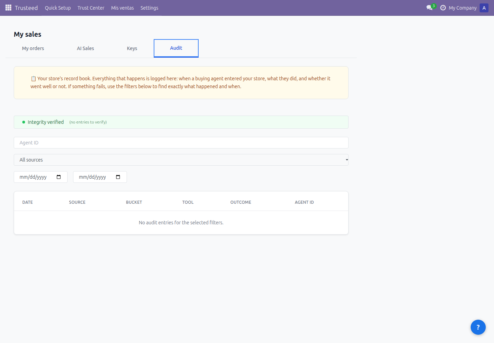
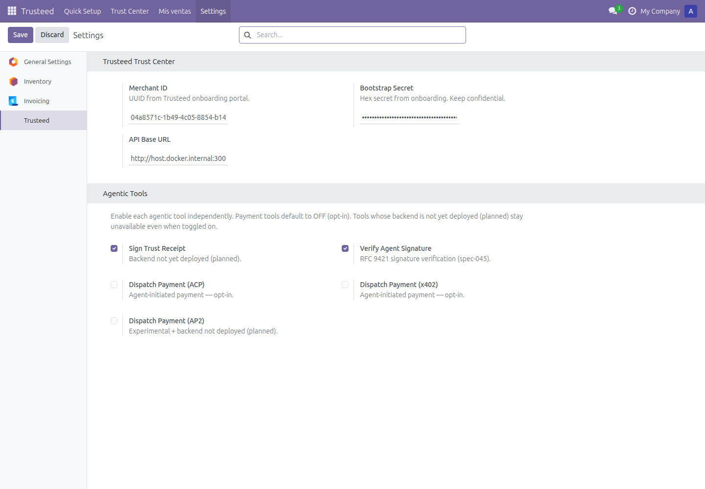
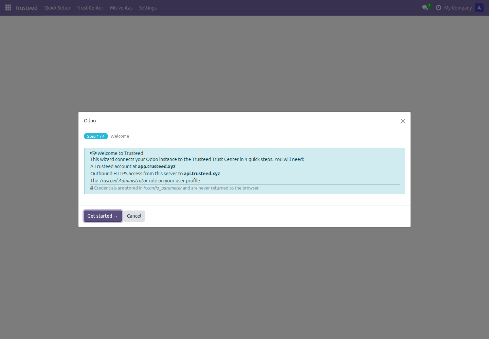
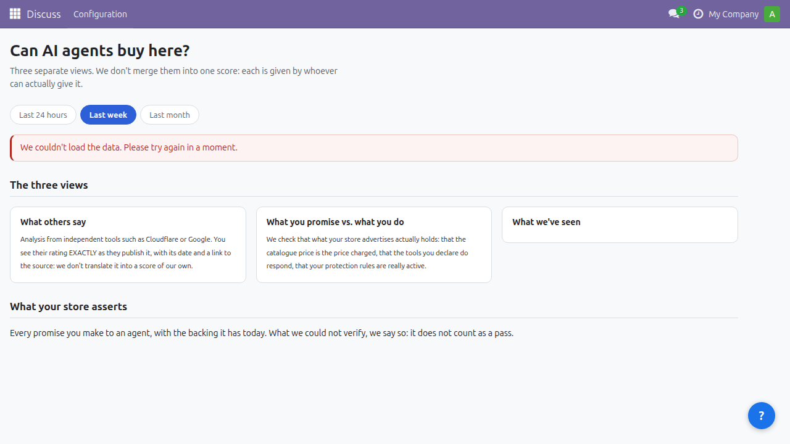

[English](README.md) | [Español](README.es.md) | [Français](README.fr.md) | **Deutsch**

# Trusteed Agentic Commerce für Odoo

KI-Agenten sind eine neue Art von Online-Käufern. Mit Trusteed, dem Netzwerk, das Unternehmen und Agenten verbindet, können sie zu Ihren Bedingungen in Ihrem Shop einkaufen.

- Legen Sie Ihre Geschäftsregeln fest: wer kaufen darf, bis zu welchem Betrag, welche Kategorien Sie Agenten nicht anbieten, Preisgrenzen, Lagerbestände, die Sie vor betrügerischen Agenten schützen, und mehr.
- Erhalten Sie signierte Belege. Jede Transaktion erzeugt einen kryptografisch signierten Beleg (JWS Ed25519), an dem sich jede Manipulation erkennen lässt und den Sie im Streitfall als Nachweis des Kaufs verwenden können. Er ist an eIDAS (EU) und an eSIGN (USA) ausgerichtet. Der Beleg ist ein Kandidat für ein fortgeschrittenes elektronisches Siegel, eine technische Einstufung, die Trusteed selbst erklärt und keine Zertifizierung durch Dritte. Er ist **kein** qualifiziertes Siegel: Heute gibt es in der Produktion weder einen qualifizierten Zeitstempel noch ein QTSP-Siegel.
- Sehen Sie, was Agenten tun: wie viel sie ausgeben, was sie kaufen und wie oft.
- Sperren Sie Agenten, die gefährlich wirken oder Probleme verursachen.
- Nehmen Sie Käufe in digitalen Währungen über das X402-Protokoll an.
- Lassen Sie Agenten und Händler direkt miteinander handeln, Peer-to-Peer.
- Prüfen Sie Ihre Agent Readiness: eine Live-Ansicht, ob KI-Agenten heute in Ihrem Shop einkaufen können. Sie hat drei unabhängige Ansichten (was andere sagen, was Sie versprechen im Vergleich zu dem, was Sie tun, was wir beobachtet haben), und sie fasst diese nie zu einer einzigen Bewertung zusammen.

## Screenshots

| Trust Center | My Sales → Meine Bestellungen | My Sales → AI Sales |
|---------------|-----------------------------------|--------------------------|
|  |  |  |

| My Sales → Schlüssel | My Sales → Audit | Einstellungen |
|---------------------------|----------------------|----------------|
|  |  |  |

| Schnelleinrichtungs-Assistent | Agent Readiness |
|--------------------------------------|------------------|
|  |  |

Jede Agententransaktion erzeugt einen signierten Vertrauensbeleg (Trust Receipt), einen Datensatz, an dem sich jede Manipulation erkennen lässt (JWS Ed25519, an eIDAS und an eSIGN ausgerichtet, ohne qualifizierten Zeitstempel). Er steht unter **My Sales → AI Sales**. Signierschlüssel und ein vollständiges Audit-Protokoll finden Sie im selben Menü **My Sales**, und der Bildschirm **Trust Center** zeigt den Gesamt-Vertrauenswert Ihres Shops.

## Funktionen

Trusteed vereint ein Trust Center, ein Verzeichnis signierter Belege und 5 native agentische Tools in einem einzigen Odoo-Addon.

- Trust Center: Vertrauenswert des Shops, signierte Trust Receipts, Signierschlüssel, Audit-Protokoll.
- My Sales: Bestellungen, Verkäufe an KI-Agenten, Signierschlüssel und Audit-Protokoll, alles in einem Menü.
- 5 native KI-Tools, bereitgestellt über `ir.actions.server` (`usage='ai_tool'`): `sign-trust-receipt`, `verify-agent-signature`, `dispatch-payment-acp`, `dispatch-payment-x402`, `dispatch-payment-ap2`. Heute sind nicht alle fünf einsatzbereit, siehe [Status der nativen KI-Tools](#status-der-nativen-ki-tools).
- Vertrauens-Badge an der Bestellung: ein berechnetes Vertrauenswert-Badge in der nativen Kanban-Ansicht von `sale.order`.
- Automatischer JWS-Beleganhang: Signierte Trust Receipts werden `account.move`-Datensätzen beim Buchen automatisch angehängt.
- Unterstützung für mehrere Unternehmen: Das Addon richtet sich still neu ein und zeigt einen Toast, wenn das aktive Unternehmen wechselt.
- Schnelleinrichtungs-Assistent: ein Onboarding in 4 Schritten, das Ihre Odoo-Instanz mit Trusteed verbindet.
- Fail-Closed-Standardeinstellungen: SSRF-geschützte ausgehende Aufrufe, nur HTTPS, und eine Durchsetzung, die bei Fehlkonfiguration nie stillschweigend erlaubt.

### Status der nativen KI-Tools

Alle fünf Tools werden bei der Installation registriert, aber nur eines ist standardmäßig aktiviert und von einem bereitgestellten Endpunkt gedeckt. Die Schalter finden Sie unter **Einstellungen → Trusteed**.

| Tool | Standard | Status heute |
|------|----------|--------------|
| `verify-agent-signature` | aktiviert | **Einsatzbereit**: Signaturprüfung nach RFC 9421 |
| `dispatch-payment-acp` | **deaktiviert** | Funktioniert, ist aber Opt-in: agenteninitiierte Zahlung, Sie aktivieren sie selbst |
| `dispatch-payment-x402` | **deaktiviert** | Funktioniert, ist aber Opt-in: agenteninitiierte Zahlung, Sie aktivieren sie selbst |
| `sign-trust-receipt` | aktiviert | **Noch kein Backend bereitgestellt**: meldet sich immer als nicht verfügbar, egal, was der Schalter sagt. Belege stellt weiterhin der Checkout-Ablauf aus, und Sie können sie unter **My Sales → AI Sales** lesen |
| `dispatch-payment-ap2` | **deaktiviert** | **Noch kein Backend bereitgestellt**: meldet sich immer als nicht verfügbar, egal, was der Schalter sagt |

Wenn Sie einen Schalter einschalten, wird ein Tool ohne bereitgestelltes Backend dadurch nie aufrufbar. Der Schalter merkt sich nur Ihre Einstellung für den Zeitpunkt, an dem dieses Backend erscheint.

**Tool-Erkennung.** `usage='ai_tool'` wird von Odoos AI App in **Odoo 19.0** vollständig unterstützt. In der Serie Odoo 18.x, auf die dieses Addon zielt, existiert das Feld, aber die Erkennungsoberfläche der AI App zeigt diese Aktionen womöglich nicht an. Programmatisch bleiben sie aufrufbar (`env.ref(...).run()`).

## Kompatibilität

| Komponente | Unterstützt |
|------------|-------------|
| Odoo | 18.0 (Community oder Enterprise) |
| Python | 3.10+ |
| Bereitstellung | Odoo.sh oder On-Premise-Installation; **nicht** verfügbar bei Odoo Online (SaaS), das benutzerdefinierte Drittanbieter-Module blockiert |

## Voraussetzungen

- Odoo 18.0, auf Odoo.sh oder einer On-Premise-Installation
- Python 3.10+
- Ein Trusteed-Konto ([kostenlos registrieren auf trusteed.xyz](https://trusteed.xyz))
- Odoo-Apps (werden automatisch als Abhängigkeiten installiert): `base`, `web`, `mail`, `sale`, `account`, `stock`, `sale_stock`
- Python-Paket `cryptography`: Es steht im Manifest unter `external_dependencies`, und Odoo verweigert die Installation des Addons ohne dieses Paket. Es dient der Ed25519-Signaturprüfung des Regel-Snapshots, der Prüfung der Agentenidentität nach RFC 9421 und der JCS-Kanonisierung nach RFC 8785. Installieren Sie es mit `pip install cryptography` auf dem Odoo-Server (bei Odoo.sh: in Ihre `requirements.txt` aufnehmen).

## Installation

### Manuelle Installation

1. **Laden Sie die installierbare `.zip`** aus dem neuesten GitHub-Release herunter:
   [**⬇ Neueste Version herunterladen**](https://github.com/Trusteedxyz/agentic-commerce-odoo/releases/latest).
   Die `.zip` hängt an diesem Release. Ältere Versionen finden Sie auf der
   [Releases-Seite](https://github.com/Trusteedxyz/agentic-commerce-odoo/releases).
2. Entpacken Sie sie in Ihren Odoo-`addons_path`. Der entpackte Ordner muss `trusteed` heißen, der technische Name des Addons.
3. Starten Sie Odoo neu: `systemctl restart odoo` (oder das Äquivalent für Ihre Bereitstellung).
4. Im Odoo-Back-Office: **Einstellungen → Entwicklermodus aktivieren**.
5. **Einstellungen → Apps → App-Liste aktualisieren**, dann nach „Trusteed“ suchen und auf **Installieren** klicken.
6. Öffnen Sie das neue Menü **Trusteed**. Der Schnelleinrichtungs-Assistent öffnet sich automatisch.

### Aus dem Quellcode (Zip selbst erstellen)

```bash
git clone https://github.com/Trusteedxyz/agentic-commerce-odoo.git
cd agentic-commerce-odoo
bash bin/build-zip.sh   # erzeugt dist/trusteed-agentic-commerce-odoo-<version>.zip
```

### Docker / lokale Entwicklung

Die Compose-Datei für Staging, die das Team nutzt (`e2e/docker/odoo-staging.yml`), liegt im privaten Entwicklungs-Monorepo von Trusteed und gehört nicht zu diesem Repository. Um das Addon in Docker auszuprobieren, starten Sie einen beliebigen Standard-Container für Odoo 18 (siehe das [offizielle Odoo-Image](https://hub.docker.com/_/odoo)) und mounten Sie den entpackten Ordner `trusteed` in einen Pfad, der im `addons_path` dieses Containers steht.

Dann in Odoo: **Einstellungen → Apps → Trusteed → Installieren**.

## Konfiguration

Der Schnelleinrichtungs-Assistent (**Trusteed → Quick Setup**) führt durch den ganzen Ablauf:

1. **Willkommen**: bestätigt die Voraussetzungen (ein Trusteed-Konto und ausgehendes HTTPS vom Odoo-Server).
2. **Verbinden**: öffnet das Trusteed-Portal unter [trusteed.xyz/dashboard](https://trusteed.xyz/dashboard), wo Sie zu **Store verbinden → Odoo** gehen.
3. **Zugangsdaten**: Fügen Sie Ihre **Merchant ID** und Ihr **Bootstrap Secret** ein (64 Hex-Zeichen).
4. **Test**: prüft die Verbindung vor dem Abschluss.

Zugangsdaten können Sie auch direkt unter **Einstellungen → Trusteed** eingeben, ohne den Assistenten zu durchlaufen.

### Systemparameter

| `ir.config_parameter`-Schlüssel | Standard | Zweck |
|-------------------------------------|----------|-------|
| `trusteed.merchant_id` | _(leer)_ | Von Trusteed ausgestellte Merchant ID |
| `trusteed.bootstrap_secret` | _(leer)_ | Bootstrap-Secret mit 64 Hex-Zeichen, `password=True`, beschränkt auf `group_admin` |
| `trusteed.api_base` | `https://api.trusteed.xyz` | Endpunkt des Trusteed-Backends |

## Admin-Menüs

Nach der Installation erscheint im Odoo-Back-Office ein Menü **Trusteed** auf oberster Ebene:

| Menü | Beschreibung |
|------|--------------|
| Quick Setup | Onboarding-Assistent in 4 Schritten |
| Trust Center | Überblick über den Vertrauenswert des Shops |
| My Sales | Meine Bestellungen, AI Sales, Schlüssel und Audit an einem Ort |
| Einstellungen | Merchant ID, Bootstrap Secret, API-Basis-URL und Schalter je Tool |

Das Admin-Panel ist ein Bundle, das mit den Konnektoren für WooCommerce und PrestaShop geteilt wird. Deshalb enthält es auch Bereiche, die der Odoo-Host nicht bereitstellt: `inicio`, `mis-reglas`, `seguridad`, `agentes`, `payment-methods` und `merchant-center`. Die Odoo-Client-Aktionen laden nur `trust-center` und `mis-ventas`, und innerhalb dieser beiden Seiten verweist nichts auf die übrigen. In Odoo sind diese Bereiche nicht erreichbar, und die Tabelle oben ist die vollständige Liste dessen, was Sie aus dem Back-Office öffnen können.

## Regeldurchsetzung beim Checkout

Über das Trust Center hinaus installiert das Addon eine Durchsetzungsschicht, die auf den eigenen Verkaufsaufträgen des Shops läuft (`models/sale_order_enforcement.py` und die Dateien drumherum). Im Überblick:

- Sie fängt die Bestätigung des Verkaufsauftrags über alle drei Eintrittspfade ab (das `action_confirm` aus Oberfläche und RPC, das Anlegen eines Auftrags direkt mit `state='sale'` und das Schreiben von `state='sale'` auf einen bestehenden Auftrag), sodass ein Headless-Client per XML-RPC oder JSON-RPC die Prüfung nicht umgehen kann.
- Bei jeder Bestätigung holt sie Ihren Regel-Snapshot von Trusteed, prüft dessen Ed25519-JWS-Signatur und hält ihn 5 Minuten im Prozess-Cache.
- Liegt ein Agenten-Token vor, wird es offline geprüft. Eine BLOCK-Entscheidung verweigert die Bestätigung mit einem Fehler `trusteed:R0xx`, der die auslösende Regel nennt.
- Ist der Snapshot nicht verfügbar, der Notausschalter aktiv oder passiert etwas Unerwartetes, entscheidet der konfigurierte Fallback-Modus: `strict` blockiert, `balanced` und `permissive` lassen den Auftrag durch. Die Bestätigung stürzt nie ab.
- Eine geplante Aktion, „Trusteed CEL: Refresh Rule Snapshot“ (`data/cron.xml`), wärmt diesen Snapshot-Cache alle 5 Minuten vor, damit der erste Auftrag jedes Intervalls nicht die Latenz des Kaltabrufs zahlt. Sie finden und deaktivieren sie unter **Einstellungen → Technisch → Automatisierung → Geplante Aktionen**.

## FAQ

**Welche Daten werden übermittelt?** Nur das, was Durchsetzungsregeln und Trust Receipts brauchen: Bestellsummen, Land und Agenten-Identität. Kartenzahlungsdaten laufen nie über Trusteed. Die gesamte Kommunikation läuft über HTTPS.

**Welche Agenten werden unterstützt?** Jeder Agent, der über einen MCP-kompatiblen Client verbunden ist und die nativen KI-Tools dieses Addons aufruft, darunter Claude Desktop. Zwei Einschränkungen, bevor Sie damit planen: Heute ist nur `verify-agent-signature` aktiviert und einsatzbereit (siehe [Status der nativen KI-Tools](#status-der-nativen-ki-tools)), und Odoos eigene AI App zeigt diese Tools nur unter Odoo 19.0 zuverlässig an. Unter 18.x erscheinen sie womöglich nicht in deren Erkennungsoberfläche.

**Verlangsamt es meinen Shop?** Nein. Die Durchsetzung läuft nur im jeweiligen Transaktionsschritt synchron, mit Fail-Closed-Standardeinstellungen statt einer pauschalen Erlauben-Rückfallebene.

**Kann ich es auf Odoo Online (SaaS) installieren?** Nein. Odoo Online erlaubt keine benutzerdefinierten Drittanbieter-Module. Nutzen Sie Odoo.sh oder eine On-Premise-Installation.

## Das Dashboard zur Agenten-Bereitschaft

**Finden mich Agenten?** ist eine Seite in Ihrem Verwaltungsbereich, die eine
einzige Frage beantwortet: Wenn ein KI-Einkaufsagent Ihren Shop besucht, bekommt
er dann das, was Sie glauben, dass er bekommt?

Es wird nie eine einzelne Note angezeigt. Drei Spalten, nie gemittelt, weil sie
unterschiedliche Fragen beantworten und sich zu Recht widersprechen können:

| Spalte | Was sie bedeutet |
| --- | --- |
| **Was ein Dritter sagt** | Das Urteil eines externen Scanners, wörtlich zitiert. Nie in eine eigene Skala umgedeutet: Sobald wir die Note eines anderen umrechnen, bewerten wir unsere eigene Prüfung |
| **Stimmt überein, was Sie sagen, mit dem, was Sie tun?** | 16 Prüfungen, die vergleichen, was Ihr Shop *ankündigt*, mit dem, was er *tatsächlich antwortet*. Das kann kein externer Scanner leisten: Es braucht Ihre Zugangsdaten |
| **Was wir gesehen haben** | Echter Agentenverkehr im gewählten Zeitraum: welche Agenten kamen, welche Tools sie nutzten, wie weit sie kamen und wo sie scheiterten |

Eine Prüfung, die nicht laufen konnte, wird als „nicht geprüft“ ausgewiesen,
mit Begründung. Sie wird nie stillschweigend verworfen und nie als bestanden
gezählt. „Wir konnten nicht nachsehen“ und „wir haben nachgesehen und es war in
Ordnung“ sind verschiedene Antworten, und die Seite sagt, welche gilt.

### Was jede Prüfung betrachtet

| Prüfung | Was sie erkennt |
| --- | --- |
| C1 | Sie kündigen Tools an, die Ihr Shop nicht bereitstellt |
| C2 | Sie kündigen ein Checkout-Protokoll an, dessen Endpunkt nicht antwortet |
| C3 | Der Katalogpreis ist nicht der berechnete Preis |
| C4 | Als verfügbar angekündigt, obwohl nicht verfügbar |
| C5 | Ihre Rückgaberichtlinie sagt je nach Fundstelle etwas anderes |
| C6 | Sie kündigen etwas als verfügbar an, das abgeschaltet ist |
| C7 | Aktivierte Regeln, die mangels Daten nicht greifen können |
| C8 | Ihre Regeln beobachten, blockieren aber nicht |
| C9 | Die angekündigte Identifizierungsmethode funktioniert nicht |
| C10 | Ein Agent kann jeden Betrag ohne Ihre Bestätigung kaufen |
| C11 | Die Verkaufsstelle verwendet abgelaufene Regeln |
| C12 | Vorgänge ohne signierten Beleg |
| C13 | Angekündigte Adressen, die nicht funktionieren |
| C14 | Agenten sehen veraltete Daten Ihres Shops |
| C15 | Identitätsnachweise kurz vor dem Ablauf |
| C16 | Die zugesagte Lieferzeit ist nicht die, die Sie einhalten |

Einige Prüfungen brauchen mehr als Ihre Einstellungen, und die Seite sagt das,
statt eine Lücke zu lassen:

- Erfordert einen verbundenen Shop (C3, C4, C5, C14): Diese Prüfungen
  vergleichen mit Ihrem echten Katalog, und ohne Zugangsdaten gibt es nichts zu
  vergleichen.
- Erfordert ausgelieferte Bestellungen (C16): Diese Prüfung vergleicht, was Sie
  zusagen, mit dem, was Sie tatsächlich eingehalten haben, und das geht ohne
  Historie nicht.
- Diesmal gab es nichts zu vergleichen: C12 zum Beispiel hat nichts zu prüfen,
  bevor ein Agent tatsächlich einen Kauf abgeschlossen hat. Das ist keine
  schlechte Note.

Die Prüfungen laufen einmal täglich, und die Seite zeigt das Ergebnis mit seinem
Datum, damit ein Urteil von gestern auch wie eines von gestern aussieht. Ein
zwischengespeichertes „alles in Ordnung“, das als aktuell dargestellt wird,
wäre genau die Selbsttäuschung, die diese Seite aufdecken soll.

## Änderungsprotokoll

### 18.0.1.2.4: Sicherheitshärtung

- Gehärtet: Die Verifizierung des Agenten-Tokens weist jetzt jede unerwartet geformte Eingabe sauber zurück, statt einen internen Fehler zu riskieren. Hier ist das kein ausnutzbarer Fehler: Anders als bei anderen Plattformen dieser Familie lässt hier kein Pfad wegen dieses Fehlers eine Bestellung durch. Aus Konsistenzgründen gehärtet, nach einer Sicherheitsmeldung zum PrestaShop-Modul. Siehe [GHSA-2j2x-5q52-g48m](https://github.com/Trusteedxyz/agentic-commerce-prestashop/security/advisories/GHSA-2j2x-5q52-g48m).

### 18.0.1.2.3

- Neu: Eine Prüfung, die nicht laufen konnte, nennt jetzt den Grund in einer von vier Gruppen (nichts zu tun, Konfiguration nötig, wartet auf Daten oder eine unserer eigenen Prüfungen ist fehlgeschlagen), statt einer einzigen Liste unerklärter Grauwerte.
- Neu: Das Panel zeigt jetzt, welcher unserer Server Ihre Anfrage beantwortet hat, als kurzes, undurchsichtiges Kürzel. Das hilft beim Vergleich mit dem, was der Support sieht. Es verrät nie einen Hostnamen oder Dienstnamen.

### 18.0.1.2.2

- Neu: Unter Einstellungen wählen Sie jetzt, welche Tools Ihr Shop an Agenten ausliefert. Wenn Sie nie eine Liste gespeichert haben, sagt Ihnen das Panel, dass das, was Sie ausliefern, der Grundumfang der Plattform ist und nicht Ihre Wahl.
- Neu: eine Schaltfläche, um die Prüfung ohne Warten auf den täglichen Durchlauf zu wiederholen, und das Panel merkt sich, was sich seit dem vorherigen Lauf geändert hat.
- Geändert: Unsere eigenen Ausfälle zählen nicht mehr als Abweichungen Ihres Shops. Das Panel trennt sie, weil Sie daran nichts ändern können.

### 18.0.1.2.1

- Behoben: Die Seite zur Agenten-Bereitschaft wurde ohne ihr Stylesheet ausgeliefert, sodass das Panel unformatiert dargestellt wurde.
- Behoben: Das Panel konnte seine Oberfläche in einer Sprache und die Diagnose in einer anderen anzeigen. Die ermittelte Sprache wird jetzt zusammen mit den Texten weitergereicht, statt zweimal erkannt zu werden.
- Behoben: Das Panel gab die Sprache des Odoo-Benutzers nicht weiter, sodass die Diagnose in der Sprache des Browsers statt in der des Benutzers zurückkam.
- Neu: Jeder Befund enthält einen Link dorthin, wo er behoben wird, und die eigenen Aussagen des Händlers (die Lieferzusage und die übrigen) erscheinen mit dem Beleg, den jede einzelne hat.
- Geändert: Ein Shop ohne bisherigen Lauf wird als „wird geprüft“ angezeigt statt als „einmal täglich geprüft“: Das Öffnen des Panels startet den ersten Lauf bereits im Hintergrund.

### 18.0.1.2.0

- Neu: Dashboard zur Agenten-Bereitschaft. *Finden mich Agenten?* gibt es jetzt im Verwaltungsbereich. Es vergleicht in 16 Prüfungen, was Ihr Shop ankündigt, mit dem, was er tatsächlich antwortet, und zeigt alle sechzehn, nicht nur die fehlgeschlagenen. Eine Prüfung, die nicht laufen konnte, nennt den Grund (Shop nicht verbunden, noch keine ausgelieferten Bestellungen, diesmal nichts zu vergleichen), statt eine Lücke zu lassen, die wie ein Fehler aussieht. Siehe „Das Dashboard zur Agenten-Bereitschaft“ oben.
- Behoben: Die Diagnose wurde in der API auf Spanisch verfasst und unverändert angezeigt, sodass ein Händler mit dem Panel auf Englisch englische Überschriften über spanischen Befunden las. Die Prüfungen liefern jetzt sprachneutrale Codes, und der Text wird beim Ausliefern in der Sprache zusammengesetzt, die Sie verwenden.
- Behoben: Prüfung C1 („Sie kündigen Tools an, die Ihr Shop nicht bereitstellt“) zählte den gesamten öffentlichen Katalog als bereitgestellt, wenn keine Tool-Liste konfiguriert war, und meldete 46 von 48 als antwortend, obwohl der Server tatsächlich 12 ausliefert. Der Fehler ging in die schmeichelhafte Richtung, genau die, die dieses Panel aufdecken soll.
- Behoben: Prüfung C6 („Sie kündigen etwas als verfügbar an, das abgeschaltet ist“) meldete eine Funktion als abgeschaltet, sobald ihr Schalter nicht gesetzt war, auch bei Schaltern, die standardmäßig aktiv sind. Das war in jedem Shop ein Fehlalarm.

### 18.0.1.1.2

- Behoben: Das Bundle des Admin-Panels (`static/src/js/admin-spa.js`) wurde nicht minifiziert ausgeliefert: 869 KB / 25.064 Zeilen statt der 490 KB / 41 Zeilen, die der dokumentierte Build-Befehl (`pnpm run build:odoo`) tatsächlich erzeugt. Es funktionierte trotzdem, aber seine Herkunft ließ sich nicht überprüfen, weil kein Diff gegen die Quelle bestätigen konnte, was es enthielt. Neu aus der Quelle gebaut. Das kompilierte Bundle stimmt jetzt zeichengenau mit dem überein, was der Build-Befehl erzeugt.
- Behoben: `R047.customer-confirmation` (die Regel, die den Käufer bittet, eine Agentenbestellung über einen separaten Kanal, per E-Mail oder SMS, zu bestätigen) hatte kein Formularfeld im Admin-Panel: Die zugehörige Betragsschwelle gab es im Schema, sie ließ sich aber nur über die API setzen. Ebenfalls behoben: Beim Anzeigen eines vom Händler gelieferten Kategorienamens wurden die rohen Prompt-Injection-Trennzeichen (`<<<MERCHANT_CONTENT_START>>> … <<<MERCHANT_CONTENT_END>>>`) darum herum ausgegeben, statt sie für die Anzeige zu entfernen.

### 18.0.1.1.1

- Behoben: `_DOCS_URL` schickte Händler zu `https://docs.trusteed.xyz/embed/odoo-onprem`, einem Host, der NXDOMAIN zurückgibt. Jeder Händler, der dem Dokumentationslink in der App folgte, bekam einen Browserfehler statt der Integrationsanleitung. Der Link zeigt jetzt auf `https://trusteed.xyz/en/integrations/odoo`.

### 18.0.1.1.0

- Sicherheitsfix: Die Replay-Erkennung des Agenten-Token-Verifizierers hing an einem `if nonce:`, sodass ein Token, das den Claim `nonce` einfach wegließ, die Offline-Replay-Erkennung komplett übersprang. Der Claim ist jetzt Pflicht (16–64 Zeichen, wie es das kanonische Token-Schema verlangt), und ein Token ohne ihn wird abgelehnt. Das ist Fail-Closed, wie bei den Konnektoren für WooCommerce, PrestaShop und Magento.
- Neu: Das Addon meldet jetzt, welche Warenkorb-Signale diese Installation projizieren kann (`POST /api/v1/enforcement/capabilities`, HMAC-signiert, gesendet aus dem Post-Init-Hook, also genau dann, wenn sich die Addon-Version ändert). Ohne diese Meldung liefert eine Regel, deren Signal nie eintrifft, bei jedem Checkout `NO_SIGNAL`: Sie lässt stillschweigend durch, und der Händler sieht eine Regel in ENFORCE, die nichts blockiert. Die Meldung reicht nie einen Fehler weiter, sodass ein Netzwerkfehler dort keine Installation und kein Upgrade abbrechen kann.

### 18.0.1.0.0

- Erste öffentliche Version: Trust Center, Mis ventas (Bestellungen, KI-Verkäufe, Schlüssel, Audit), Schnelleinrichtungs-Assistent, Integration in die Einstellungen, 5 native KI-Tools, Vertrauens-Badge an der Bestellung, automatischer JWS-Beleganhang, Unterstützung für mehrere Unternehmen.

## Support

- Support-E-Mail: support@trusteed.xyz
- GitHub Issues: [github.com/Trusteedxyz/agentic-commerce-odoo/issues](https://github.com/Trusteedxyz/agentic-commerce-odoo/issues)

## Lizenz

LGPL-3.0. Den vollständigen Text finden Sie in [LICENSE](LICENSE). Sie entspricht der in `__manifest__.py` deklarierten Lizenz.
