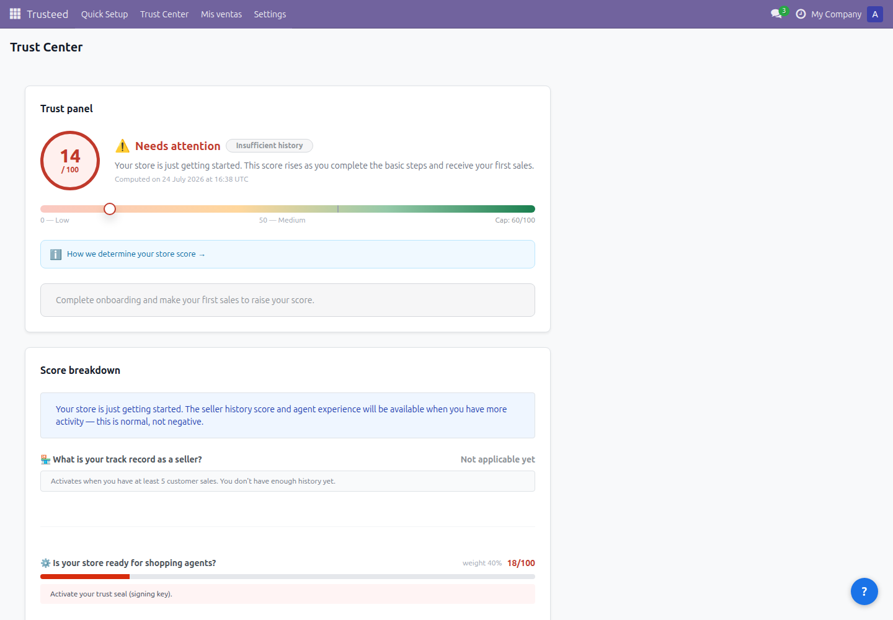
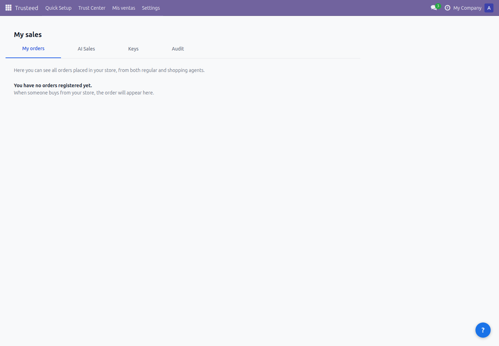
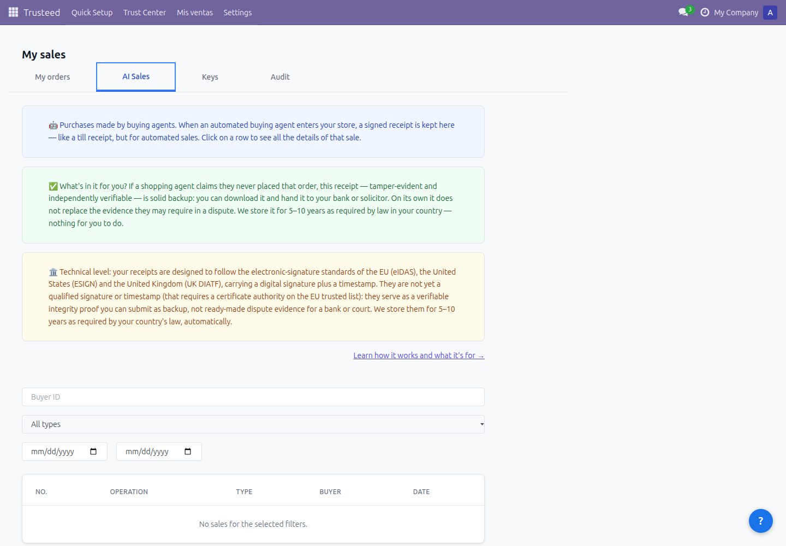
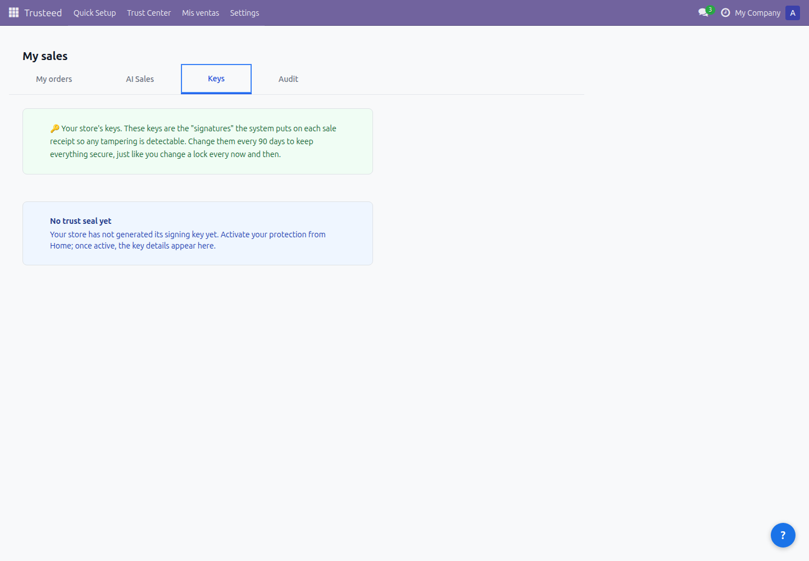
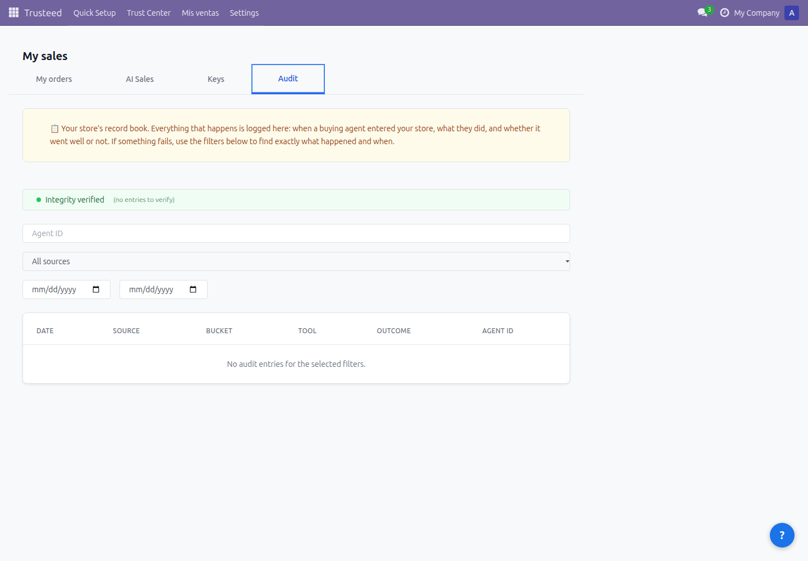
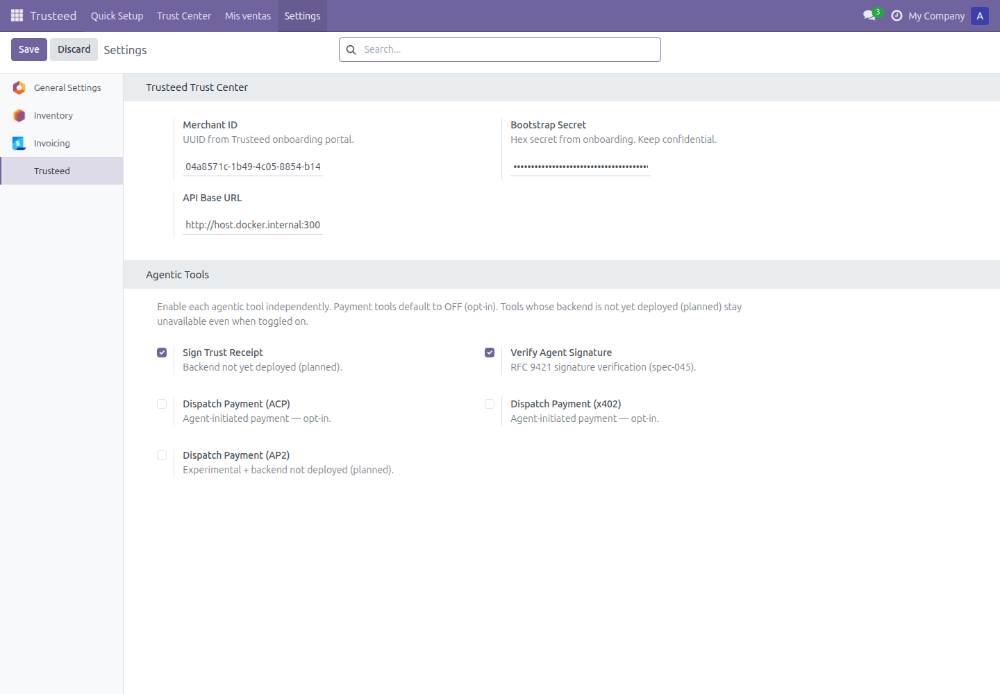
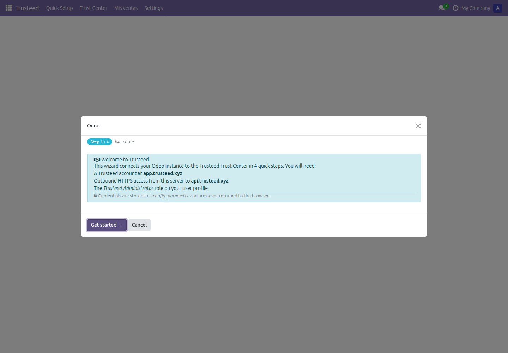

**English** | [Español](README.es.md) | [Français](README.fr.md) | [Deutsch](README.de.md)

# Trusteed Agentic Commerce for Odoo

Enable new online shoppers, AI agents, to make purchases in your store securely and reliably thanks to Trusteed: the network that fosters trust between businesses and agents.

- **Set your business rules**: who you allow to buy, up to what amount, which categories you don't want to offer to agents, set price limits, maintain stock levels to protect yourself against potential fraudulent agents, and more.
- **Tamper-proof receipts**: we generate cryptographically signed, tamper-evident receipts (JWS Ed25519) that serve as evidence of the actual transaction in case of any dispute. They are designed around the evidentiary concepts of eIDAS (EU, UK) and eSIGN (USA) — an advanced-style electronic signature, **not** a qualified one: there is no qualified timestamp or QTSP seal in production today.
- **Agent analytics**: view statistics on agent purchases — how much they spend, what products they buy, and how often.
- **Agent blocking**: block potentially dangerous or problematic agents.
- **Digital currencies**: enables purchases in digital currencies thanks to the X402 protocol.
- **Peer-to-peer transactions**: enables direct peer-to-peer commerce between agents and merchants.

## Screenshots

| Trust Center | My Sales — My Orders | My Sales — AI Sales |
|---------------|-----------------------|----------------------|
|  |  |  |

| My Sales — Keys | My Sales — Audit | Settings |
|-------------------|---------------------|----------|
|  |  |  |

| Quick Setup Wizard |
|----------------------|
|  |

Every agent transaction produces a cryptographically signed **trust receipt** — a tamper-evident record (JWS Ed25519, aligned with eIDAS / eSIGN evidentiary concepts, without a qualified timestamp) listed under **My Sales → AI Sales**. Signing keys and a full audit log are available under the same **My Sales** menu, and the **Trust Center** screen surfaces your store's overall trust score.

## Features

Trusteed consolidates a Trust Center, a signed-receipts ledger, and 5 native agentic tools into a single Odoo addon.

- **Trust Center** — store trust score, signed trust receipts, signing keys, audit log
- **My Sales** — orders, AI-agent sales, signing keys, audit log, all in one menu
- **5 native AI tools** exposed via `ir.actions.server` (`usage='ai_tool'`): `sign-trust-receipt`, `verify-agent-signature`, `dispatch-payment-acp`, `dispatch-payment-x402`, `dispatch-payment-ap2` — **not all five are live today**, see [Native AI tool status](#native-ai-tool-status)
- **Sale order trust badge** — a computed trust-score badge injected into the native `sale.order` kanban view
- **JWS receipt auto-attachment** — signed trust receipts are attached to `account.move` records automatically on posting
- **Multi-company support** — silent re-bootstrap with a toast notification when the active company changes
- **Quick Setup wizard** — a 4-step onboarding flow that connects your Odoo instance to Trusteed
- **Fail-closed defaults** — SSRF-guarded outbound calls, HTTPS-only, enforcement never silently allows when misconfigured

### Native AI tool status

All five tools are registered on install, but only one of them is both enabled by default and backed by a deployed endpoint. Toggles live under **Settings → Trusteed**.

| Tool | Default | Status today |
|------|---------|--------------|
| `verify-agent-signature` | on | **Operational** — RFC 9421 signature verification |
| `dispatch-payment-acp` | **off** | Works, but opt-in: agent-initiated payment, you enable it yourself |
| `dispatch-payment-x402` | **off** | Works, but opt-in: agent-initiated payment, you enable it yourself |
| `sign-trust-receipt` | on | **No backend deployed yet** — always reports unavailable, whatever the toggle says. Receipts are still issued by the checkout pipeline and readable under **My Sales → AI Sales** |
| `dispatch-payment-ap2` | **off** | **No backend deployed yet** — always reports unavailable, whatever the toggle says |

Turning a toggle on never makes a tool with no deployed backend invocable; the toggle only preserves your preference for when that backend ships.

**Tool discovery.** `usage='ai_tool'` is fully supported by Odoo's AI App on **Odoo 19.0**. On the Odoo 18.x series this addon targets, the field exists but the AI App discovery UI may not surface these actions — they stay callable programmatically (`env.ref(...).run()`).

## Compatibility

| Component | Supported |
|-----------|-----------|
| Odoo | 18.0 (Community or Enterprise) |
| Python | 3.10+ |
| Deployment | Odoo.sh or on-premise — **not** available on Odoo Online (SaaS), which blocks custom third-party modules |

## Requirements

- Odoo 18.0, on Odoo.sh or an on-premise installation
- Python 3.10+
- A Trusteed account — [sign up free at trusteed.xyz](https://trusteed.xyz)
- **Odoo apps** (installed automatically as dependencies): `base`, `web`, `mail`, `sale`, `account`, `stock`, `sale_stock`
- **Python package `cryptography`** — declared in the manifest's `external_dependencies`; Odoo refuses to install the addon without it. Used for Ed25519 rule-snapshot signature verification, RFC 9421 agent-identity verification, and RFC 8785 JCS canonicalization. Install with `pip install cryptography` on the Odoo host (Odoo.sh: add it to your `requirements.txt`).

## Installation

### Manual install

1. **Download the installable `.zip`** from the latest GitHub Release:
   [**⬇ Download the latest release**](https://github.com/Trusteedxyz/agentic-commerce-odoo/releases/latest)
   — the `.zip` asset is attached to that release. Older versions are on the
   [Releases page](https://github.com/Trusteedxyz/agentic-commerce-odoo/releases).
2. Extract it into your Odoo `addons_path` — the extracted folder must be named `trusteed` (this is the addon's technical name).
3. Restart Odoo: `systemctl restart odoo` (or equivalent for your deployment).
4. In the Odoo Back Office: **Settings → Activate developer mode**.
5. **Settings → Apps → Update Apps List**, then search for "Trusteed" and click **Install**.
6. Open the new **Trusteed** menu — the Quick Setup wizard opens automatically.

### From source (build the zip yourself)

```bash
git clone https://github.com/Trusteedxyz/agentic-commerce-odoo.git
cd agentic-commerce-odoo
bash bin/build-zip.sh   # outputs dist/trusteed-agentic-commerce-odoo-<version>.zip
```

### Docker / local dev

The staging compose file the maintainers use (`e2e/docker/odoo-staging.yml`) lives in Trusteed's private development monorepo and is **not** part of this repository. To try the addon in Docker, run any standard Odoo 18 container — see the [official Odoo image](https://hub.docker.com/_/odoo) — and mount the extracted `trusteed` folder into a path listed in that container's `addons_path`.

Then in Odoo: **Settings → Apps → Trusteed → Install**.

## Configuration

The Quick Setup wizard (**Trusteed → Quick Setup**) walks through the whole flow:

1. **Welcome** — confirms prerequisites (a Trusteed account + outbound HTTPS from the Odoo host).
2. **Connect** — opens the Trusteed Portal at [trusteed.xyz/dashboard](https://trusteed.xyz/dashboard), where you navigate to **Connect a Store → Odoo**.
3. **Credentials** — paste your **Merchant ID** and **Bootstrap Secret** (64 hex characters).
4. **Test** — verifies connectivity before finishing.

Credentials can also be entered directly under **Settings → Trusteed**, without going through the wizard.

### System parameters

| `ir.config_parameter` key | Default | Purpose |
|----------------------------|---------|---------|
| `trusteed.merchant_id` | _(empty)_ | Merchant ID issued by Trusteed |
| `trusteed.bootstrap_secret` | _(empty)_ | 64-hex-char bootstrap secret, `password=True`, gated to `group_admin` |
| `trusteed.api_base` | `https://api.trusteed.xyz` | Trusteed backend endpoint |

## Admin Menus

After installation, a **Trusteed** top-level menu appears in the Odoo Back Office:

| Menu | Description |
|------|--------------|
| Quick Setup | 4-step onboarding wizard |
| Trust Center | Store trust score overview |
| My Sales | My Orders, AI Sales, Keys, Audit — all in one place |
| Settings | Merchant ID, Bootstrap Secret, API base URL, and per-tool toggles |

The admin panel is a bundle shared with the WooCommerce and PrestaShop connectors, so it also contains sections the Odoo host does not expose: `inicio`, `mis-reglas`, `seguridad`, `agentes`, `payment-methods` and `merchant-center`. The Odoo client actions mount only `trust-center` and `mis-ventas`, and nothing inside those two pages links to the others — so in Odoo those sections are unreachable, and the table above is the full list of what you can open from the Back Office.

## Checkout enforcement

Beyond the Trust Center, the addon installs an enforcement layer that runs on the store's own sale orders (`models/sale_order_enforcement.py` and the files around it). What it does, at a high level:

- It intercepts **sale order confirmation** through all three entry paths — the UI/RPC `action_confirm`, creating an order directly with `state='sale'`, and writing `state='sale'` on an existing one — so a headless XML-RPC or JSON-RPC client cannot skip the check.
- On each confirmation it pulls your **rule snapshot** from Trusteed, verifies its Ed25519 JWS signature, and caches it in-process for 5 minutes.
- If an agent token is present it is verified offline; a **BLOCK** decision refuses the confirmation with a `trusteed:R0xx` error naming the rule that fired.
- If the snapshot is unavailable, the kill-switch is on, or anything unexpected happens, the configured **fallback mode** decides: `strict` blocks, `balanced` and `permissive` let the order through. It never crashes the confirmation.
- A scheduled action, **"Trusteed CEL: Refresh Rule Snapshot"** (`data/cron.xml`), warms that snapshot cache **every 5 minutes** so the first order of each interval does not pay the cold-pull latency. You can find and disable it under **Settings → Technical → Automation → Scheduled Actions**.

## FAQ

**What data is sent?** Only what enforcement rules and trust receipts require (order totals, country, agent identity). No payment card data ever passes through Trusteed. All communication uses HTTPS.

**Which agents are supported?** Any agent connected through an MCP-compatible client that calls the native AI tools this addon exposes, including Claude Desktop. Two caveats worth knowing before you plan around it: only `verify-agent-signature` is enabled and operational today (see [Native AI tool status](#native-ai-tool-status)), and Odoo's own AI App only surfaces these tools reliably on Odoo 19.0 — on 18.x they may not appear in its discovery UI.

**Does it slow down my store?** No. Enforcement runs synchronously only at the relevant transaction step, with fail-closed defaults instead of a blanket allow fallback.

**Can I install this on Odoo Online (SaaS)?** No — Odoo Online does not allow custom third-party modules. Use Odoo.sh or an on-premise deployment.

## The agent readiness dashboard

**Can agents find me?** is a page inside your admin panel that answers one
question: when an AI shopping agent visits your store, does it get what you
think it gets?

It never shows a single score. Three columns, never averaged, because they
answer different questions and can legitimately disagree:

| Column | What it is |
| --- | --- |
| **What a third party says** | The verdict of an external scanner, quoted verbatim. Never reinterpreted into a scale of ours — the moment we rescale someone else's grade, we are grading our own exam |
| **Does what you say match what you do?** | 16 checks that contrast what your store *advertises* against what it *actually answers*. This is the part no external scanner can do: it needs your credentials |
| **What we have seen** | Real agent traffic in the selected window — which agents arrived, which tools they used, how far they got, and where they failed |

A check that could not run is reported as **not checked**, with the reason. It is
never silently dropped and never counted as a pass. "We could not look" and
"we looked and it was fine" are different answers, and the page says which one
it is.

### What each check looks at

| Check | What it detects |
| --- | --- |
| C1 | You advertise tools your store does not serve |
| C2 | You advertise a checkout protocol whose endpoint does not answer |
| C3 | The catalogue price is not the price charged |
| C4 | Things are advertised as available when they are not |
| C5 | Your return policy says different things depending on where you look |
| C6 | You advertise as available something that is switched off |
| C7 | Rules switched on that cannot act for lack of data |
| C8 | Your rules observe but do not block |
| C9 | The identification method you advertise does not work |
| C10 | An agent can buy any amount without your confirmation |
| C11 | The point of sale is using expired rules |
| C12 | Operations with no signed receipt |
| C13 | Advertised addresses that do not work |
| C14 | Agents are seeing stale data from your store |
| C15 | Identity credentials about to expire |
| C16 | The delivery time you promise is not the one you meet |

Some checks need more than your settings to run, and the page says so instead of
leaving a gap:

- **Needs your store connected** (C3, C4, C5, C14) — they compare against your
  real catalogue, and without credentials there is nothing to compare with.
- **Needs delivered orders** (C16) — it compares what you promise against what
  you actually met, and that cannot be done without history.
- **Nothing to compare this time** — for example, C12 has nothing to check until
  an agent has actually completed a purchase. That is not a failing grade.

The checks run once a day and the page shows the result **with its date**, so a
verdict from yesterday looks like a verdict from yesterday. A cached "all good"
presented as current would be exactly the kind of self-deception this page
exists to catch.

## Changelog

### 18.0.1.2.0

- **New — agent readiness dashboard.** *Can agents find me?* now ships in the admin panel. It contrasts what your store advertises against what it actually answers, in **16 checks**, and shows all sixteen — not only the ones that fail. A check that could not run says **why** (store not connected, no delivered orders yet, nothing to compare this time) instead of leaving a gap that reads like a fault. See "The agent readiness dashboard" above.
- **Fixed** — the diagnosis was written in Spanish inside the API and shown verbatim, so a merchant with the panel in English read English headings above Spanish findings. The checks now emit language-neutral codes and the text is composed when served, in the language you are using.
- **Fixed** — check C1 ("you advertise tools your store does not serve") counted the full public catalogue as served when no tool list was configured, reporting 46 of 48 answering when the server actually serves 12. It failed in the flattering direction, which is the one this panel exists to catch.
- **Fixed** — check C6 ("you advertise as available something that is switched off") reported a capability as off whenever its flag was unset, even for flags that are on by default. It was a false alarm on every store.

### 18.0.1.1.2

- **Fixed** — the admin panel bundle (`static/src/js/admin-spa.js`) shipped unminified: 869 KB / 25,064 lines instead of the 490 KB / 41 lines the documented build command (`pnpm run build:odoo`) actually produces. It still worked, but its provenance could not be verified — no diff against the source could confirm what it contained. Rebuilt from source; the compiled bundle now matches character-for-character what the build command produces.
- **Fixed** — `R047.customer-confirmation` (the rule that asks the buyer to confirm an agent order out of band, by email or SMS) had no form field in the admin panel: its amount threshold existed in the schema but could only be set via the API. Also fixed: rendering a merchant-supplied category name printed the raw prompt-injection delimiters (`<<<MERCHANT_CONTENT_START>>> … <<<MERCHANT_CONTENT_END>>>`) around it instead of stripping them for display.

### 18.0.1.1.1

- **Fixed** — `_DOCS_URL` sent merchants to `https://docs.trusteed.xyz/embed/odoo-onprem`, a host that returns NXDOMAIN. Every merchant who followed the in-app docs link got a browser error instead of the integration guide. Now points at `https://trusteed.xyz/en/integrations/odoo`.

### 18.0.1.1.0

- **Security fix** — the agent token verifier's replay detection hung off `if nonce:`, so a token that simply omitted the `nonce` claim skipped offline replay detection entirely. The claim is now mandatory (16–64 characters, as the canonical token schema requires) and a token without it is rejected — fail-closed, matching the WooCommerce, PrestaShop and Magento connectors.
- **Added** — the addon now reports which cart signals this installation can project (`POST /api/v1/enforcement/capabilities`, HMAC-signed, sent from the post-init hook, which is exactly when the addon version changes). Without it, a rule whose signal never arrives returns `NO_SIGNAL` on every checkout: it passes silently, and the merchant sees a rule in ENFORCE that blocks nothing. The report never propagates a failure — a network error there cannot break an install or upgrade.

### 18.0.1.0.0

- Initial public release: Trust Center, Mis ventas (orders, AI sales, keys, audit), Quick Setup wizard, Settings integration, 5 native AI tools, sale-order trust badge, JWS receipt auto-attachment, multi-company support.

## Support

- Support email: support@trusteed.xyz
- GitHub issues: [github.com/Trusteedxyz/agentic-commerce-odoo/issues](https://github.com/Trusteedxyz/agentic-commerce-odoo/issues)

## License

LGPL-3.0. See [LICENSE](LICENSE) for full text — matches the license declared in `__manifest__.py`.
